<table width="100%"> <tr> <td width="36%" align="center" valign="middle">  <br /> <sub><b>dr codieverse</b> · Personal Website</sub> </td> <td width="64%" valign="middle">

This repository is designed as the personal website and public founder dossier of Dr. Ferdi Iskandar — a structured digital home for identity, work, writing, speaking profile, selected systems, public credibility surfaces, and AI-assisted visitor guidance.

Purpose
To present Dr. Ferdi Iskandar's public identity with clarity, credibility, and institutional tone.
To organize professional background, founder journey, leadership work, healthcare AI initiatives, and public-facing projects.
To provide a navigable founder dossier for partners, media, event organizers, collaborators, healthcare leaders, and technology communities.
To support AI-augmented public profile exploration through Abby, while preserving safe boundaries, controlled knowledge, and editorial consistency.

<p> <b>Founder, Sentra Artificial Intelligence</b><br /> Physician · Hospital CEO · AI-Native Healthcare Systems Builder<br /> Kediri, Indonesia · UTC+7 </p>

<p>     </p>

<p> <a href="https://ferdiiskandar.com" title="Personal Website"></a>&nbsp;&nbsp; <a href="https://medium.com/@drferdiiskandar" title="Medium"></a>&nbsp;&nbsp; <a href="https://orcid.org/0009-0003-3788-1307" title="ORCID iD"></a>&nbsp;&nbsp; <a href="https://x.com/ClaudesyI81047" title="X / Twitter"></a>&nbsp;&nbsp; <a href="https://substack.com/@drferdiiskandar" title="Substack"></a>&nbsp;&nbsp; <a href="https://www.kaggle.com/drferdiiskandar" title="Kaggle"></a>&nbsp;&nbsp; <a href="https://www.reddit.com/user/SixCupaCoffee/" title="Reddit"></a>&nbsp;&nbsp; <a href="https://www.linkedin.com/in/dr-ferdi-iskandar-1b620a3b5" title="LinkedIn"></a>&nbsp;&nbsp; <a href="https://huggingface.co/dr-Ferdi" title="Hugging Face"></a> </p> </td> </tr> </table>
---

## 01 · Executive Intent

**Sentra Founder Dossier** is not a generic personal portfolio. It is a structured public-profile infrastructure for presenting the identity, work, credibility, writing, systems, speaking surface, and collaboration pathways of **dr Ferdi Iskandar**.

The repository exists to make the founder's public presence:

- clearer for media, partners, event organizers, and institutional visitors;
- easier to navigate through route-based editorial surfaces;
- safer to ask about through a bounded AI assistant named **Abby**;
- consistent with the Sentra ecosystem's design principle: **clarity first, intelligence second, decoration last**.

> A founder website should not merely display information. It should reduce ambiguity, build trust, and guide the visitor toward the right next action.

---

## 02 · Product Positioning

<table>
<tr>
<td width="33%" valign="top">

### Founder Dossier

A publication-grade personal website for explaining identity, leadership history, work domains, public credibility, and collaboration routes.

</td>
<td width="33%" valign="top">

### Abby AI Assistant

A controlled public assistant that helps visitors understand the founder, the website, selected work, speaking context, and collaboration pathways.

</td>
<td width="33%" valign="top">

### Public Profile Infrastructure

A Next.js application with curated routes, AI provider abstraction, Markdown knowledge files, safety boundaries, metadata, verification commands, and deployment discipline.

</td>
</tr>
</table>

---

## 03 · Sentra Design Language

This README uses a more visual Sentra-style documentation layer: structured, institutional, warm, colorful, and system-oriented.

| Design principle | Application in this README |
|---|---|
| **Hero-first clarity** | The repository identity is visible immediately at the top. |
| **Diagram-rich explanation** | Architecture, flow, boundaries, and verification are visualized with Mermaid. |
| **Color-coded domains** | Public routes, AI layers, knowledge, security, and deployment use distinct colors. |
| **Executive readability** | Sections are written for fast scanning by founder, engineer, auditor, or collaborator. |
| **No noisy decoration** | Colors support structure; they do not replace substance. |

---

## 04 · System at a Glance

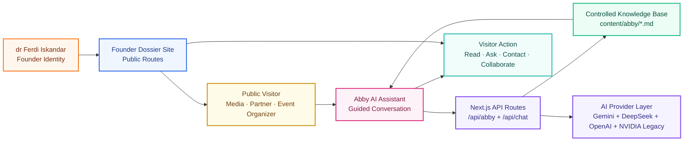

---

## 05 · Product Surfaces

The application is organized as a route-based founder dossier. Every public route has a job. Nothing should exist only because it looks impressive.

<table>
<tr>
<th align="left">Surface</th>
<th align="left">Route</th>
<th align="left">Primary function</th>
<th align="left">Audience</th>
</tr>
<tr>
<td><b>Editorial Homepage</b></td>
<td><code>/</code></td>
<td>Introduce the founder, authority, work domains, and route hierarchy.</td>
<td>All visitors</td>
</tr>
<tr>
<td><b>About</b></td>
<td><code>/about</code></td>
<td>Explain biography, professional transition, leadership background, and founder identity.</td>
<td>Partners, media, collaborators</td>
</tr>
<tr>
<td><b>Works</b></td>
<td><code>/works</code></td>
<td>Present selected systems, projects, and initiatives connected to healthcare and AI.</td>
<td>Technical and institutional visitors</td>
</tr>
<tr>
<td><b>Notes</b></td>
<td><code>/notes</code></td>
<td>Publish thinking, essays, reflections, and conceptual updates.</td>
<td>Readers, collaborators, public audience</td>
</tr>
<tr>
<td><b>Kisah Sentra</b></td>
<td><code>/kisah-sentra</code></td>
<td>Tell the founding story of Sentra as an editorial narrative.</td>
<td>Readers, collaborators, public audience</td>
</tr>
<tr>
<td><b>Tanpa Naskah</b></td>
<td><code>/tanpa-naskah</code></td>
<td>Collect unscripted quotes and reflections from the founder, grouped by theme.</td>
<td>Readers, collaborators, public audience</td>
</tr>
<tr>
<td><b>Human – AI Collab</b></td>
<td><code>/bagaimana-sentra-dibangun</code></td>
<td>Document the dr Ferdi × Voss brainstorming session behind Sentra's clinical architecture.</td>
<td>Readers, technical and institutional visitors</td>
</tr>
<tr>
<td><b>Speaking</b></td>
<td><code>/speaking</code></td>
<td>Support event evaluation, speaker invitation, and public-stage positioning.</td>
<td>Event organizers, institutions</td>
</tr>
<tr>
<td><b>CV</b></td>
<td><code>/cv</code></td>
<td>Present credentials, leadership roles, medical background, and public authority.</td>
<td>Formal reviewers, partners</td>
</tr>
<tr>
<td><b>Abby Widget</b></td>
<td>Client overlay</td>
<td>Guide visitors conversationally through public profile and website context.</td>
<td>Visitors who prefer asking instead of browsing</td>
</tr>
<tr>
<td><b>Abby API</b></td>
<td><code>/api/abby</code></td>
<td>Main AI conversation endpoint with provider abstraction and safety boundaries.</td>
<td>Application runtime</td>
</tr>
<tr>
<td><b>Legacy Chat API</b></td>
<td><code>/api/chat</code></td>
<td>Secondary NVIDIA-based chat path retained for legacy experimentation.</td>
<td>Maintainers only</td>
</tr>
</table>

---

## 06 · Route Gravity Map

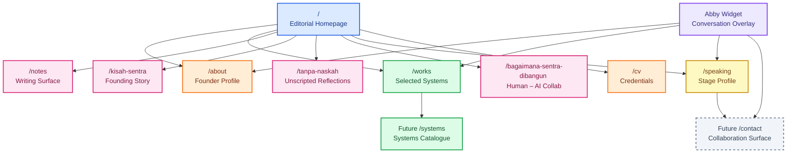

---

## 07 · Abby AI Assistant

**Abby** is the personal AI assistant for the public website. Abby is designed to help visitors understand public information, not to create new private claims or act as a clinical system.

| Field | Value |
|---|---|
| **Name** | Abby |
| **Role** | Personal AI assistant for dr Ferdi Iskandar |
| **Primary endpoint** | `/api/abby` |
| **Default language** | Bahasa Indonesia |
| **Primary knowledge source** | `content/abby/*.md` |
| **System prompt** | `src/prompts/abby.system-prompt.md` |
| **Default provider** | Gemini |
| **Alternate provider** | DeepSeek, OpenAI |
| **Legacy provider** | NVIDIA through `/api/chat` |

Abby should answer from controlled context, route visitors to the right public surface, and preserve safe scope at all times.

---

## 08 · Abby Conversation Pipeline

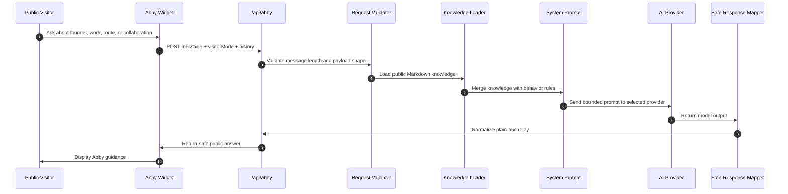

---

## 09 · Knowledge Architecture

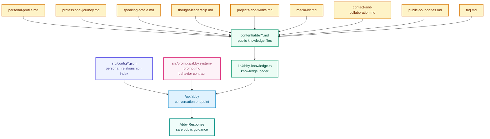

---

## 10 · Controlled Knowledge Files

| File | Purpose |
|---|---|
| `content/abby/personal-profile.md` | Founder identity, biography, and reusable public answers. |
| `content/abby/professional-journey.md` | Career timeline and transition narrative. |
| `content/abby/speaking-profile.md` | Speaking topics, stage bio, and event-introduction material. |
| `content/abby/thought-leadership.md` | Principles, worldview, and conceptual positioning. |
| `content/abby/projects-and-works.md` | Project catalogue and filtering guidance. |
| `content/abby/founder-narrative-pages.md` | Kisah Sentra, Human – AI Collab, and Tanpa Naskah page summaries. |
| `content/abby/media-kit.md` | Press materials and interview support. |
| `content/abby/contact-and-collaboration.md` | Outreach routing and collaboration boundaries. |
| `content/abby/public-boundaries.md` | What Abby can say, cannot say, and must not infer. |
| `content/abby/faq.md` | Frequently asked questions and canonical answers. |

Supporting configuration:

| File | Purpose |
|---|---|
| `src/config/abby.config.json` | Core behavior and API settings. |
| `src/config/abby.persona.json` | Personality and tone configuration. |
| `src/config/abby.relationship.json` | Relationship and context rules. |
| `src/config/abby.knowledge-index.json` | Knowledge file indexing. |
| `src/prompts/abby.system-prompt.md` | System-level instruction contract. |

---

## 11 · Provider Strategy

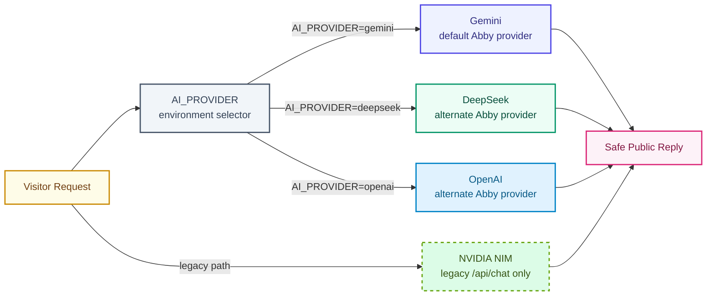

| Provider mode | Endpoint | Status | Notes |
|---|---|---|---|
| `AI_PROVIDER=gemini` | `/api/abby` | Primary | Default Abby provider (via Gemini's OpenAI-compatible endpoint). |
| `AI_PROVIDER=deepseek` | `/api/abby` | Alternate | Provider abstraction path. |
| `AI_PROVIDER=openai` | `/api/abby` | Alternate | Provider abstraction path. |
| `NVIDIA_API_KEY` | `/api/chat` | Legacy | Secondary chat route; not the primary Abby system. |

---

## 12 · API Contract

### `POST /api/abby`

Main Abby conversation endpoint.

Request:

```json
{
  "message": "Who is dr Ferdi Iskandar?",
  "visitorMode": "public_visitor",
  "history": []
}
```

Response:

```json
{
  "reply": "dr Ferdi Iskandar is a physician, hospital CEO, and founder building work at the intersection of healthcare, leadership, and artificial intelligence."
}
```

Operational behavior:

| Feature | Implementation |
|---|---|
| Rate limiting | Per-IP fixed window, 20 requests per 60 seconds. |
| Provider switching | Controlled by `AI_PROVIDER`. |
| Request validation | Message required, 1–2000 characters. |
| Timeout protection | 28 seconds for Abby, 25 seconds for legacy chat. |
| Error mapping | Safe, non-leaking upstream error responses. |
| Output normalization | Plain text, no Markdown. |
| Cache control | `Cache-Control: no-store` on API responses. |

### `POST /api/chat`

Legacy chat endpoint powered by NVIDIA NIM.

Status: secondary path. Abby remains the primary AI experience.

---

## 13 · Safety Boundary Model

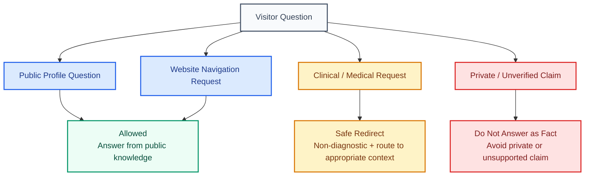

Abby is **not**:

- a medical diagnosis engine;
- a medical device;
- a triage system;
- an EMR workflow engine;
- a private decision-maker;
- an authority for unsupported biographical, clinical, or institutional claims.

Abby is allowed to support:

- website navigation;
- public profile explanation;
- project and work summaries;
- speaking and collaboration routing;
- general educational context with non-diagnostic boundaries;
- clarification based on the curated public knowledge base.

---

## 14 · Security and Governance Boundary

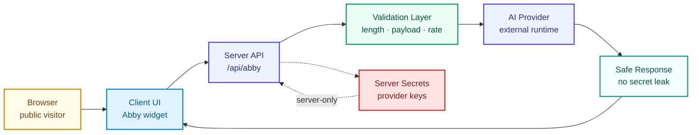

| Area | Current practice |
|---|---|
| Secrets | Server-side only; never exposed to browser or Git. |
| API protection | Rate limiting, request validation, timeout protection, safe errors. |
| Headers | Global security headers configured in `next.config.mjs`. |
| Dependencies | Audited through `pnpm security:deps`. |
| Cache | `Cache-Control: no-store` on AI API responses. |
| Threat model | See `docs/security/threat-model.md`. |

---

## 15 · Application Architecture

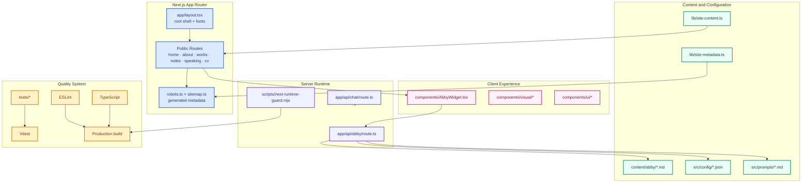

---

## 16 · Key Component Relationships

| Component | Depends on | Provides |
|---|---|---|
| `app/layout.tsx` | Fonts, smooth scroll provider, global layout | Root application shell |
| `app/page.tsx` | Site content, visual components | Editorial homepage |
| `components/AbbyWidget.tsx` | `/api/abby` | Public AI assistant overlay |
| `app/api/abby/route.ts` | Provider SDKs, knowledge loader, prompt config | Main Abby conversation endpoint |
| `app/api/chat/route.ts` | NVIDIA NIM SDK | Legacy chat endpoint |
| `lib/abby-knowledge.ts` | `content/abby/*.md` | Structured knowledge loading |
| `lib/site-content.ts` | Curated copy data | Route-level content |
| `lib/site-metadata.ts` | Site content and metadata rules | Route-aware metadata builder |
| `scripts/next-runtime-guard.mjs` | Runtime lock file | Build/dev process protection |

---

## 17 · Repository Structure

```text
apps/corporate/ferdiiskandar/
├── app/                         # Next.js App Router routes
│   ├── about/                   # About page
│   ├── api/
│   │   ├── abby/route.ts        # Main Abby assistant endpoint
│   │   └── chat/route.ts        # Legacy NVIDIA chat endpoint
│   ├── cv/                      # CV route
│   ├── globals.css              # Primary editorial stylesheet
│   ├── layout.tsx               # Root layout with fonts/providers
│   ├── page.tsx                 # Homepage entry
│   └── robots.ts / sitemap.ts   # Generated metadata
├── components/                  # React components
│   ├── ui/                      # Shared UI primitives
│   ├── visual/                  # Visual and motion components
│   └── *.tsx                    # Page-level feature components
├── content/abby/                # Abby knowledge base Markdown files
├── docs/                        # Architecture, specs, reports, governance, archive docs
├── lib/                         # Utilities, content data, hooks
├── public/                      # Static assets and images
│   ├── icons/                   # Tech provider icons
│   └── images/                  # Team and product photos
├── src/
│   ├── config/                  # Abby JSON configs
│   └── prompts/                 # System prompts
├── tests/                       # Vitest and Playwright tests
└── scripts/                     # Build/runtime guards
```

---

## 18 · Local Development

### Quick Start

```bash
# 1. Install dependencies from monorepo root
pnpm install

# 2. Move into the app directory
cd apps/corporate/ferdiiskandar

# 3. Copy environment template
cp .env.example .env.local

# 4. Add AI provider credentials
# AI_PROVIDER=gemini
# GEMINI_API_KEY=your-key-here

# 5. Start the development server
pnpm dev

# 6. Open the local site
# http://localhost:3000
```

### Installation Modes

From monorepo root:

```bash
pnpm install
pnpm --filter @the-abyss/ferdiiskandar dev
```

From app directory:

```bash
cd apps/corporate/ferdiiskandar
pnpm install
pnpm dev
```

Production build:

```bash
pnpm build
pnpm start
```

---

## 19 · Environment Contract

```env
# AI Provider selection: "gemini" default, or "deepseek" / "openrouter" / "openai"
AI_PROVIDER=gemini

# Gemini required when AI_PROVIDER=gemini (uses Gemini's OpenAI-compatible endpoint)
GEMINI_API_KEY=
# ABBY_MODEL=gemini-2.5-flash

# DeepSeek required when AI_PROVIDER=deepseek
# DEEPSEEK_API_KEY=
# DEEPSEEK_BASE_URL=https://api.deepseek.com
# ABBY_MODEL=deepseek-chat

# OpenAI required when AI_PROVIDER=openai
# OPENAI_API_KEY=
# ABBY_MODEL=gpt-4o-mini

# Legacy only, used by /api/chat. Not required for Abby.
NVIDIA_API_KEY=
```

Rules:

- Use `.env.local` for local secrets.
- Do not commit provider keys.
- Do not expose provider keys to browser code.
- Keep `/api/chat` as legacy unless intentionally reactivated.
- Keep Abby's primary contract on `/api/abby`.

---

## 20 · Runtime Guard

The build process is protected by `scripts/next-runtime-guard.mjs`.

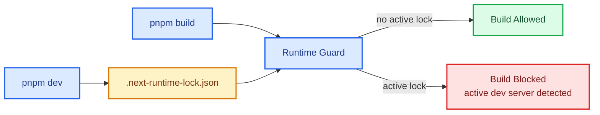

The guard prevents accidental build execution while a dev runtime is active in the same app workspace.

---

## 21 · Verification Matrix

| Command | Purpose |
|---|---|
| `pnpm typecheck` | TypeScript type checking. |
| `pnpm lint` | ESLint with `--max-warnings=0`. |
| `pnpm test` | Run Vitest suite once. |
| `pnpm test:watch` | Run Vitest in watch mode. |
| `pnpm test:coverage` | Run Vitest with coverage report. |
| `pnpm build` | Production build. |
| `pnpm security:deps` | Dependency security audit, app-scoped. |
| `pnpm knip` | Dead-code and unused export detection. |

Current test contracts:

- sitemap contract;
- site metadata contract;
- site content contract;
- Next runtime guard behavior;
- smoke tooling baseline;
- navbar route awareness;
- about page rendering.

Coverage thresholds: **80%** for lines, functions, branches, and statements.

---

## 22 · Verification Flow

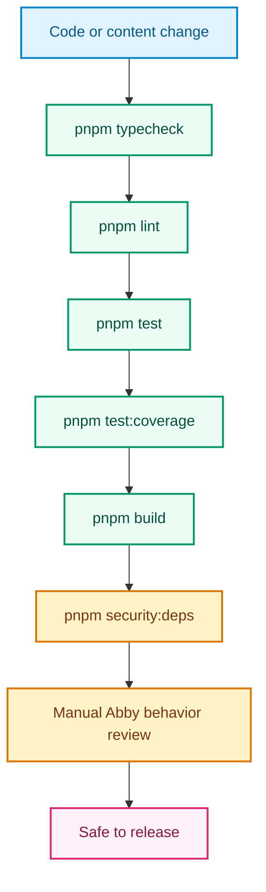

---

## 23 · Operating Standard

```text
No public claim without controlled context.
No AI answer without boundary awareness.
No clinical guidance without non-diagnostic limits.
No API route without validation and timeout protection.
No deployment without build, typecheck, test, and security review.
```

| Question | Required answer |
|---|---|
| What public problem does this solve? | It helps visitors understand the founder, work, routes, and collaboration surfaces. |
| Who is accountable? | The founder/site owner remains accountable for public content and positioning. |
| What is outside scope? | Diagnosis, treatment advice, private medical interpretation, and unsupported claims. |
| What can fail? | Provider outage, missing API keys, stale knowledge, route regression, unsafe prompt drift. |
| How is it verified? | Build, typecheck, lint, tests, coverage, dependency audit, and manual Abby behavior checks. |

---

## 24 · Roadmap

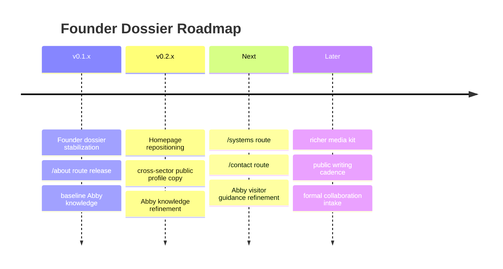

| Target | Focus | Status |
|---|---|---|
| `v0.1.x` | Founder dossier stabilization | Released |
| `v0.1.x` | `/about` route, layered authority page | Released |
| `v0.1.x` | Abby knowledge refinement | Active |
| `v0.2.x` | Homepage content repositioning, cross-sector | Active |
| `v0.2.x` | `/about` copy repositioning | Active |
| Later | `/systems` route | Planned |
| Later | `/notes` route | Planned |
| Later | `/contact` route | Planned |
| Later | Abby UX and visitor guidance refinement | Planned |

---

## 25 · Contribution Rule

See `docs/governance/contributing.md` for development workflow, coding standards, and pull request requirements.

Recommended rule:

```text
Keep public content clear.
Keep Abby bounded.
Keep routes intentional.
Keep API behavior safe.
Keep verification repeatable.
```

---

## 26 · License

MIT License — see `LICENSE` for details.

---

## 27 · Contact Desk

<p align="center">
  <a href="https://ferdiiskandar.com" target="_blank">
    
  </a>
  <a href="mailto:drferdiiskandar@melinda.co.id">
    
  </a>
  <a href="mailto:drferdiiskandar@sentrahai.com">
    
  </a>
  <a href="https://medium.com/@drferdiiskandar" target="_blank">
    
  </a>
  <a href="https://www.linkedin.com/in/dr-ferdi-iskandar-1b620a3b5/" target="_blank">
    
  </a>
  <a href="https://g.dev/classyy" target="_blank">
    
  </a>
  <a href="https://x.com/ClaudesyI81047" target="_blank">
    
  </a>
  <a href="https://www.kaggle.com/drferdiiskandar" target="_blank">
    
  </a>
</p>

---

<div align="center">

<b>Architected and maintained as part of the Sentra Artificial Intelligence ecosystem.</b>

<sub>Founder dossier infrastructure · Abby AI Assistant · public profile intelligence · controlled editorial surface.</sub>

</div>
